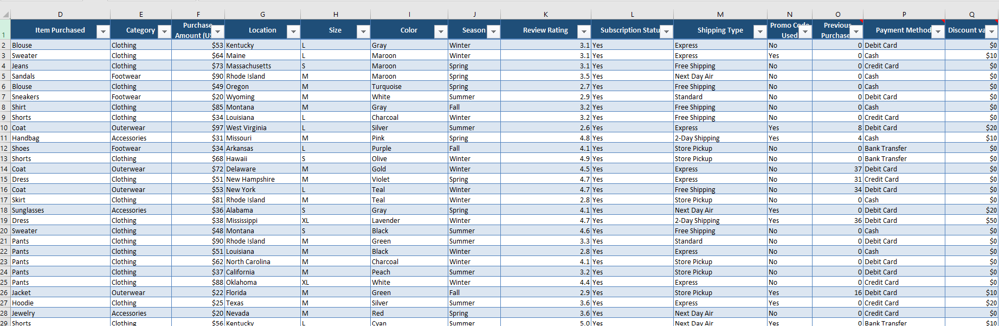
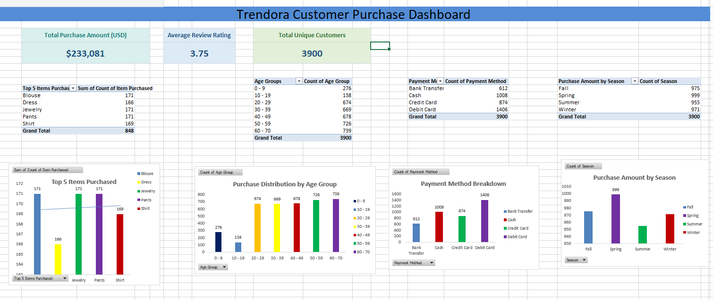

# Trendora Sales Data Analysis Report 

## Header

## Executive Summary
This report analyzes Trendora’s retail sales data from 3,900 customer purchases. It looks at customer demographics, buying habits, sales performance, promotions, payment methods, and seasonal sales trends.
The analysis shows that the Clothing category made the most revenue, female customers contributed the highest share of sales, and Fall had the best sales performance. Debit cards were the most used payment method, while promotions had a moderate effect on customer spending.
The report also identifies opportunities for Trendora to improve customer retention, strengthen promotional strategies, and boost sales in weaker product categories.

## Business Context
Trendora operates in the retail and fashion industry, selling products such as clothing, accessories, footwear, and outerwear across different locations.
This analysis was carried out to understand customer buying patterns, improve customer satisfaction, increase revenue, and support better business decisions using historical sales data.

## Objectives
This report addresses the following key questions:
- To understand overall sales performance and how the business is doing financially.
- To identify the top-performing product categories and best-selling items.
- To understand customer demographics and purchasing behavior patterns.
- To analyze seasonal trends and how sales change across different times of the year.
- To evaluate how promo codes and discounts influence customer purchases.
- To understand preferred customer payment methods.
-  To highlight opportunities for improving sales, customer experience, and overall business growth.

## Data Overview
The analysis includes 3,900 retail sales records from Trendora customers across different locations. It includes customer demographics, product categories, purchase amounts, payment methods, promotions, and seasonal sales data used to analyze buying patterns and sales performance. 

## Data Preview

## Key Findings
- The analysis showed that Trendora generated total revenue of $233,081, with an average customer spend of $59.76 per transaction and an average review rating of 3.75 out of 5. 
- Clothing was the top revenue driver, outpacing other categories. Accessories also performed well, indicating customer interest in complementary fashion items.
- Female customers made up the largest share of sales, making them the primary segment. Fall saw the highest sales, but sales were fairly stable year-round.
- Debit cards were the most used payment method, showing a preference for quick, direct payments. Promotions influenced purchases, but there is still room to optimize promotional strategies for better profitability. 

## Dashboard

Link to interactive dashboard: [Click Here](https://1drv.ms/x/c/23AC5A9C029F60DE/IQBdn25tr96kSL0u3veyG7NPAbjdCSrIVGRIHBnPwaSN4cA)

## Data Cleaning and Transformation
Several data preparation steps were carried out to improve the quality and usability of the dataset,these steps improved data accuracy and ensured reliable analytical outputs.
- Verified column consistency and naming structure.
- Checked for missing or null values.
- Reviewed duplicate records.
- Standardized categorical fields such as gender, category, and payment methods.
- Ensured numerical fields were correctly formatted.
- Grouped customer ages into age categories.
- Aggregated sales values by category, season, and payment method.
- Calculated total sales, average purchase values, and review ratings.
- Generated summarized insights for dashboard visualization.

## Detailed Findings & Analysis
### 1. Category Performance Analysis
- The Clothing category significantly outperformed all other categories, contributing nearly half of total revenue, showing strong demand for fashion apparel.
- Accessories also performed strongly, suggesting customers often make complementary purchases alongside clothing.
- Outerwear generated the lowest revenue, indicating lower demand or limited product variety
- Apparel is Trendora’s main revenue driver, making inventory optimization and product variety in this category critical for growth. 
### 2. Customer Demographics Analysis
- Female customers contributed over 70% of total sales revenue, making them the dominant customer group. The company may benefit from:
- Expanding women-focused product lines.
- Introducing more targeted campaigns for male customers.
-  Developing personalized shopping experiences.
### 3. Seasonal Trend Analysis
- Sales were relatively stable across all seasons, with Fall slightly outperforming others.
- This shows consistent year-round demand rather than reliance on a peak season.
- Maintaining consistent inventory levels and seasonal promotional campaigns could help sustain year-round profitability.
### 4. Payment Method Analysis
- Debit cards were the most used payment method, followed by cash and credit cards.
- This shows a preference for direct payment methods over credit-based options.
- Optimizing digital payment systems can improve convenience and transaction efficiency. 
### 5. Promo Code and Discount Analysis
The dataset indicates that promotional discounts were actively used by some customers.
While discounts may encourage purchases, excessive reliance on promotions can reduce profitability if not carefully managed.
Trendora should evaluate:
- Which promotions generate the highest conversion rates.
- Customer segments most responsive to discounts.
- Long-term customer retention after promotional purchases.

## Recommendations
Based on the analysis, the following recommendations are proposed:
### Product Strategy
- Expand the Clothing category with more product variety.
- Improve marketing visibility for underperforming categories such as Outerwear.
- Introducing bundle offers combining clothing and accessories.
### Customer Engagement
- Create personalized campaigns targeting female shoppers.
- Develop promotional strategies aimed at increasing male customer engagement.
- Introduce customer loyalty and retention programs.
### Sales & Marketing
- Optimize seasonal campaigns during Fall and Spring.
- Use targeted discount strategies instead of broad promotions.
- Analyze high-performing products for replication opportunities.
### Customer Experience
- Improve customer service and delivery experience.
- Collect more customer feedback to identify dissatisfaction points.
- Enhance online shopping convenience and checkout experience.
### Operations
- Prioritize inventory planning for high-demand categories.
- Strengthen digital payment infrastructure.
- Use predictive analytics for demand forecasting.

## Tools Used
- Microsoft Excel : Data cleaning and dashboard preparation 
- Pivot Tables :Aggregation and summarization 

## Conclusion
Trendora’s sales analysis shows strong clothing sales and high female customer engagement, with stable performance across seasons. The report highlights opportunities to improve customer satisfaction, promotional strategies, and underperforming categories. Implementing the recommendations provided can enhance profitability, loyalty, and data-driven decision-making.

